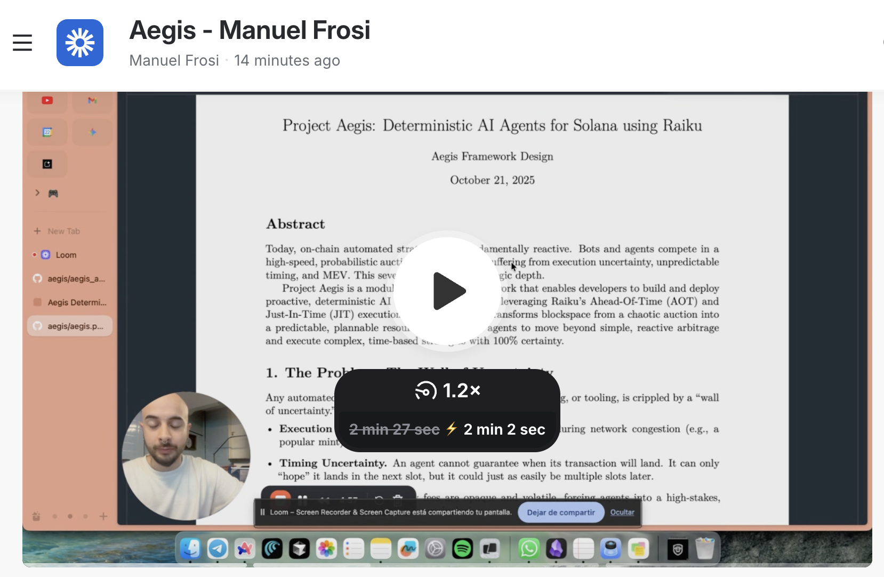
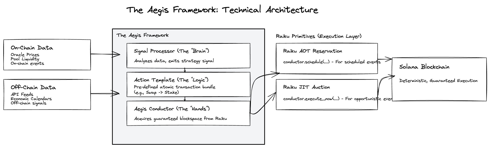

# Project Aegis

### A Framework for Deterministic AI Agents on Solana

This repository contains the concept submission for the **Raiku and Superteam BR Deterministic Execution Challenge**.

---

## 2-Minute Concept Video

*(**Note:** Click the image above to watch the video.)*

---

## The Core Concept

Project Aegis is a modular, open-source framework that enables developers to build and deploy **proactive, deterministic AI agents** on Solana.

Current on-chain automation is **reactive**, forcing bots to compete in a chaotic, probabilistic auction for blockspace. This leads to execution failures, uncertain timing, and high costs.

Aegis uses Raiku's execution guarantees—**Ahead-Of-Time (AOT) slot reservations** and **Just-In-Time (JIT) slot auctions**—to transform blockspace into a predictable, plannable resource. This allows an AI agent to move beyond simple, reactive arbitrage and execute complex, time-based strategies with 100% certainty.

## Submission Deliverables

This repository contains all the required deliverables for the submission.

* 📄 **[Concept Document](./aegis.pdf):** A 2-page document detailing the problem, solution, framework architecture, and use cases.

* 🎥 **[Loom Video](videolink.algo):** A loom video explaining the architecture and demoing the use-cases.

* 📺 **[Demo Use Cases](https://v0-aegis-prototype-design.vercel.app/):** Web page for visualizing the advantages using *Aegis* will have in agentic execution.

* 🎨 **[Visual Blueprint](./aegis_arch.png):** The architecture and sequence diagrams created in Excalidraw.

---

## Visual Blueprint

The following diagrams are included in the concept document and are presented here for clarity.

### Technical Architecture

This diagram shows the modular components of the Aegis Framework and how it connects developer logic to Raiku's primitives.

